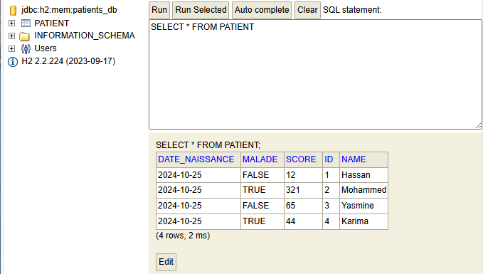
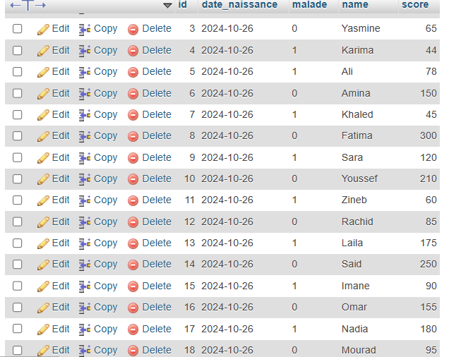
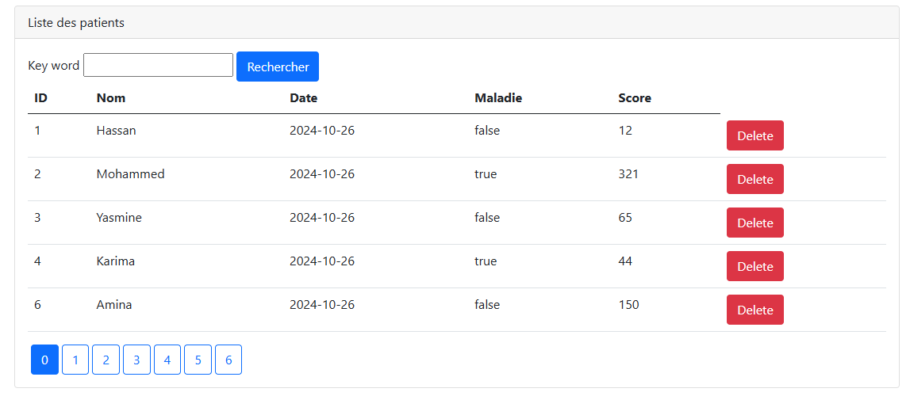
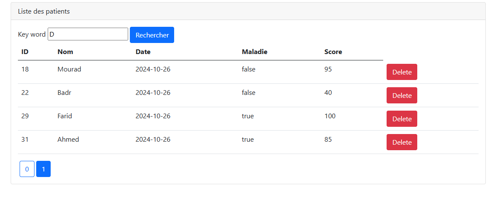
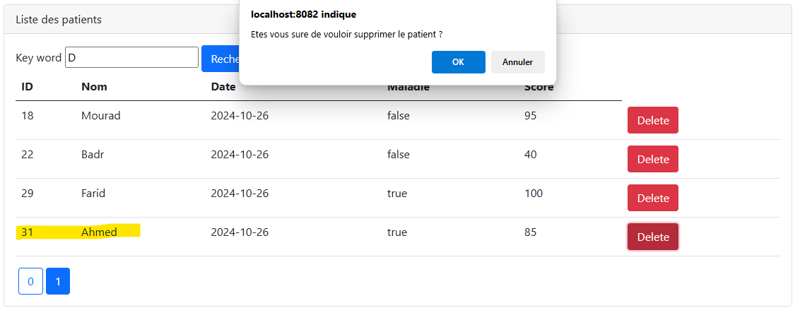

<h1>Spring MVC - Gestion des Patients</h1>
<h2>Liste des patients affichée dans H2 Database Console</h2>

<h2>Liste des patients affichée dans MySQL</h2>

<h2>Page d'accueil</h2>

<h2>Résultats de la recherche des patients par mot-clé</h2>

<h2>Suppression d'un patient</h2>
<h3>Confirmation de suppression</h3>

<h3>Patient supprimé</h3>
